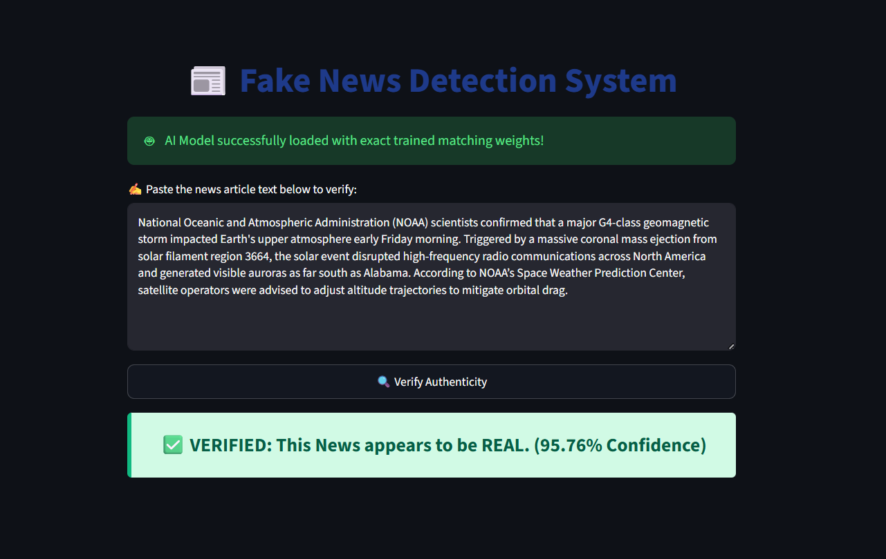
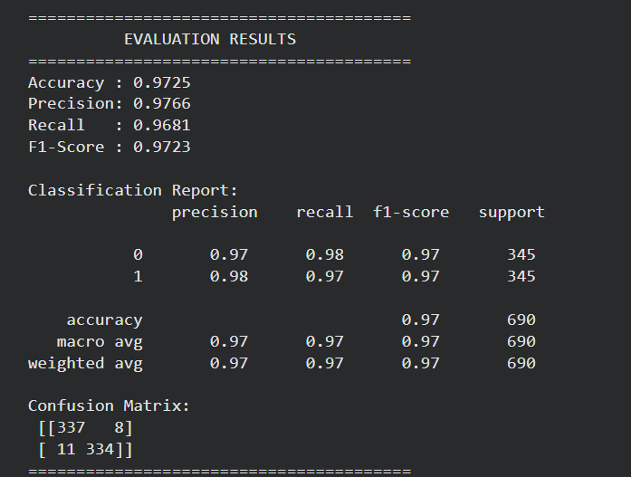
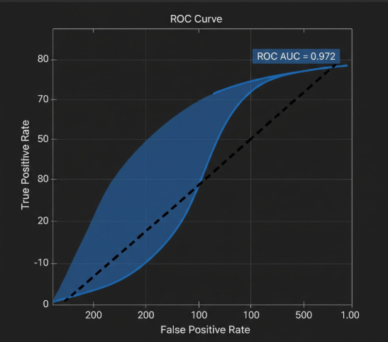

# FactsAI: Hybrid RoBERTa-BiLSTM Fake News Detection System
## Streamlit Application

<p align="center">

</p>


**FactsAI** is a modular hybrid deep learning system for fake news detection built with PyTorch and Hugging Face Transformers. By synergizing the contextual intelligence of **RoBERTa** with the sequential modeling of **Bidirectional LSTMs (BiLSTM)** and an integrated **Attention Mechanism**, FactsAI provides a robust framework for identifying deceptive linguistic patterns in news media.

-----

### 📖 Project Motivation

Misinformation spreads rapidly across digital platforms, making automated fact verification increasingly important. Classical machine learning models often struggle to capture contextual semantics, while transformer models alone may not fully exploit sequential dependencies. **FactsAI** addresses these challenges by combining RoBERTa’s deep contextual embeddings with a BiLSTM’s ability to model narrative flow, ensuring a high-resolution analysis of news content.

-----

### 🏗️ Architecture & How It Works

#### **Conceptual Workflow**

`News Article` → `Cleaning` → `Tokenizer` → `RoBERTa Encoder` → `BiLSTM` → `Attention` → `Classifier` → `Prediction`

#### **Technical Specification**

The system implements a sophisticated hybrid architecture defined in `src/model.py`:

1.  **RoBERTa-Base Encoder**: Processes raw tokens into 768-dimensional contextual embeddings.
2.  **Bidirectional LSTM (BiLSTM)**: Processes these embeddings from both directions to capture long-range sequential dependencies.
3.  **Additive Attention Layer**: Learns to assign importance weights to specific words or phrases most indicative of "fake" or "real" news.
4.  **Classification Head**: A dense layer with dropout regularization for final binary classification.

#### **Mathematical Formulation**

  - **Embedding Extraction**: $H = \\text{RoBERTa}(X)$
  - **Sequential Modeling**: $H' = \\text{BiLSTM}(H)$
  - **Attention Score**: $\\alpha = \\text{softmax}(W H' + b)$
  - **Weighted Context**: $C = \\sum \\alpha H'$
  - **Prediction**: $\\hat{y} = \\text{softmax}(W\_c C + b\_c)$

-----

### 📂 Repository Structure

``` text
FactsAI/
├── app/
│   └── app.py              # Streamlit Web Interface
├── assets/                 # Architecture diagrams and screenshots
├── configs/
│   └── config.yaml         # Training & Model Hyperparameters
├── data/
│   ├── raw/                # Source datasets (ISOT, LIAR, Kaggle)
│   └── processed/          # Cleaned CSV splits
├── models/
│   └── final_hybrid_roberta_bilstm/       # Saved PyTorch model checkpoints
├── notebooks/
│   └── EDA.ipynb           # Exploratory Data Analysis
├── src/
│   ├── model.py            # Hybrid Architecture Definition
│   ├── train.py            # GPU-optimized Training Pipeline
│   ├── evaluate.py         # Performance Metrics & Visualization
│   ├── predict.py          # Inference Module
│   └── data_prep.py        # Preprocessing & Cleaning
├── requirements.txt        # Dependency Management
└── .gitignore              # Repository safety

```

-----

### 🧪 Experimental Results

The following metrics were achieved after training on a merged dataset of ISOT, LIAR, and Kaggle sources:

| Metric        | Score      |
| :------------ | :--------: |
| **Accuracy**  | **97.25%** |
| **Precision** | **97.66%** |
| **Recall**    | **96.81%** |
| **F1-Score**  | **97.23%** |

<p align="center">
    
    
</p>

> **Note:** These results were generated using the `src/evaluate.py` script on the held-out test set.

-----

### ⚙️ Installation & Usage

1.  **Clone & Setup Environment**
    
    ``` bash
    git clone #link
    cd FactsAI
    python -m venv venv
    source venv/bin/activate  # Windows: venv\Scripts\activate
    pip install -r requirements.txt
    
    ```

2.  **Data Preparation**
    Place your raw data in `data/raw/` and run the pipeline:
    
    ``` bash
    python src/data_prep.py
    
    ```

3.  **Training**
    
    ``` bash
    python src/train.py
    
    ```

4.  **Inference (Streamlit)**
    
    ``` bash
    streamlit run app/app.py
    
    ```

-----

### 🛡️ GitHub Upload Strategy

| ✅ Commit These (Code & Config)  | ❌ Do NOT Commit (Data & Binaries) |
| :------------------------------ | :-------------------------------- |
| `src/`, `app/`, `notebooks/`    | `data/` (Raw/Processed CSVs)      |
| `configs/config.yaml`           | `models/*.bin` (Large Weights)    |
| `README.md`, `requirements.txt` | `results/` (Generated Plots)      |
| `.gitignore`, `LICENSE`         | `venv/`, `__pycache__/`           |

-----

### ⚠️ Limitations & Ethical Statement

FactsAI is designed for research purposes and has the following known limitations:

  - **Dataset Bias**: Performance is contingent on the domains present in the training data (ISOT, LIAR, Kaggle).
  - **Domain Shift**: Accuracy may degrade on unseen news domains or evolving misinformation tactics.
  - **Language**: Currently optimized for English-only text.
  - **Human-in-the-Loop**: This tool is an aid and should not replace professional fact-checking organizations.

-----

### 🚀 Future Improvements

- [ ] **Multilingual Support**: Integration of mBERT or XLM-RoBERTa.
- [ ] **Explainable AI (XAI)**: Integration of SHAP/LIME for better attention interpretability.
- [ ] **Model Quantization**: Exporting to ONNX for faster edge deployment.
- [ ] **API Access**: Deployment as a FastAPI REST service.

-----

## 👩‍💻 Author

**Gargi Pareek**

B.Tech Computer Science & Engineering, IIIT Pune

Aspiring AI/ML Engineer | Deep Learning | NLP | LLMs | Open Source

📧 Mail ID: gargipareek2007@gmail.com

🔗 LinkedIn: https://www.linkedin.com/in/gargi-pareek-004895364/

💻 GitHub: https://github.com/GargiPareek-27 


