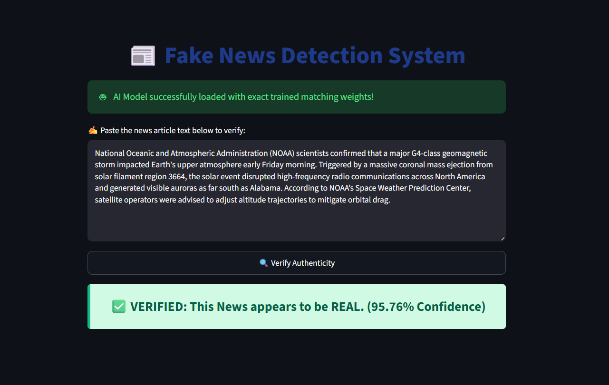

# FactsAI: Hybrid RoBERTa-BiLSTM Fake News Detection System
## Streamlit Application

<p align="center">

</p>


**FactsAI** is a modular hybrid deep learning system for fake news detection built with PyTorch and Hugging Face Transformers. By synergizing the contextual intelligence of **RoBERTa** with the sequential modeling of **Bidirectional LSTMs (BiLSTM)** and an integrated **Attention Mechanism**, FactsAI provides a robust framework for identifying deceptive linguistic patterns in news media.

-----

### 📖 Project Motivation

Misinformation spreads rapidly across digital platforms, making automated fact verification increasingly important. Classical machine learning models often struggle to capture contextual semantics, while transformer models alone may not fully exploit sequential dependencies. **FactsAI** addresses these challenges by combining RoBERTa’s deep contextual embeddings with a BiLSTM’s ability to model narrative flow, ensuring a high-resolution analysis of news content.

-----

### 🏗️ Architecture & How It Works

#### **Conceptual Workflow**

`News Article` → `Cleaning` → `Tokenizer` → `RoBERTa Encoder` → `BiLSTM` → `Attention` → `Classifier` → `Prediction`

#### **Technical Specification**

The system implements a sophisticated hybrid architecture defined in `src/model.py`:

1.  **RoBERTa-Base Encoder**: Processes raw tokens into 768-dimensional contextual embeddings.
2.  **Bidirectional LSTM (BiLSTM)**: Processes these embeddings from both directions to capture long-range sequential dependencies.
3.  **Additive Attention Layer**: Learns to assign importance weights to specific words or phrases most indicative of "fake" or "real" news.
4.  **Classification Head**: A dense layer with dropout regularization for final binary classification.

#### **Mathematical Formulation**

  - **Embedding Extraction**: $H = \\text{RoBERTa}(X)$
  - **Sequential Modeling**: $H' = \\text{BiLSTM}(H)$
  - **Attention Score**: $\\alpha = \\text{softmax}(W H' + b)$
  - **Weighted Context**: $C = \\sum \\alpha H'$
  - **Prediction**: $\\hat{y} = \\text{softmax}(W\_c C + b\_c)$

-----

### 📂 Repository Structure

``` text
FactsAI/
├── app/
│   └── app.py              # Streamlit Web Interface
├── assets/                 # Architecture diagrams and screenshots
├── configs/
│   └── config.yaml         # Training & Model Hyperparameters
├── data/
│   ├── raw/                # Source datasets (ISOT, LIAR, Kaggle)
│   └── processed/          # Cleaned CSV splits
├── models/
│   └── final_hybrid_roberta_bilstm/       # Saved PyTorch model checkpoints
├── notebooks/
│   └── EDA.ipynb           # Exploratory Data Analysis
├── src/
│   ├── model.py            # Hybrid Architecture Definition
│   ├── train.py            # GPU-optimized Training Pipeline
│   ├── evaluate.py         # Performance Metrics & Visualization
│   ├── predict.py          # Inference Module
│   └── data_prep.py        # Preprocessing & Cleaning
├── requirements.txt        # Dependency Management
└── .gitignore              # Repository safety

```

-----


### ⚙️ Installation & Usage

1.  **Clone & Setup Environment**
    
    ``` bash
    git clone https://github.com/GargiPareek-27/FactsAI.git
    cd FactsAI
    python -m venv venv
    source venv/bin/activate  # Windows: venv\Scripts\activate
    pip install -r requirements.txt
    
    ```

2.  **Data Preparation**
    Place your raw data in `data/raw/` and run the pipeline:
    
    ``` bash
    python src/data_prep.py
    
    ```

3.  **Training**
    
    ``` bash
    python src/train.py
    
    ```

4.  **Inference (Streamlit)**
    
    ``` bash
    streamlit run app/app.py
    
    ```

-----

### 🛡️ GitHub Upload Strategy

| ✅ Commit These (Code & Config)  | ❌ Do NOT Commit (Data & Binaries) |
| :------------------------------ | :-------------------------------- |
| `src/`, `app/`, `notebooks/`    | `data/` (Raw/Processed CSVs)      |
| `configs/config.yaml`           | `models/*.bin` (Large Weights)    |
| `README.md`, `requirements.txt` | `results/` (Generated Plots)      |
| `.gitignore`, `LICENSE`         | `venv/`, `__pycache__/`           |

-----

### ⚠️ Known Limitations & Fix History

This is a learning/research project, and issues found along the way are
disclosed deliberately rather than glossed over.

**Fixed:**

- **`from_pretrained` was missing entirely.** `src/evaluate.py` and
  `src/predict.py` both called `RoBERTaBiLSTM.from_pretrained(model_dir)`,
  but the class only defined `save_pretrained` — `nn.Module` doesn't
  provide a `from_pretrained` for free, so both scripts crashed
  immediately. `save_pretrained` now also writes a small
  `hybrid_config.json` recording the constructor arguments
  (`lstm_hidden_size`, `lstm_layers`, `dropout`, `use_attention`,
  `num_labels`), and the new `from_pretrained` classmethod uses it to
  rebuild the exact same architecture before loading weights in.
- **Attention wasn't masking padding.** The additive attention layer in
  `src/model.py` computed its softmax over the full sequence, including
  padded positions, letting them absorb attention weight and dilute the
  context vector — most noticeable on short inputs with heavy padding.
  It now masks padded timesteps to `-inf` before the softmax (and the
  no-attention mean-pooling fallback now also excludes padding).
- **`config.yaml` was unused.** `src/train.py` hardcoded its own
  hyperparameters, so editing `configs/config.yaml` had no effect on a
  training run. `train.py` now loads the YAML and uses it for model
  architecture, learning rate, batch size, warmup ratio, and gradient
  clipping; explicit function arguments still override it if needed.
- **`early_stopping_patience` was declared but never checked.** It's now
  wired into the training loop in `src/train.py`: training stops once
  validation loss hasn't improved for that many epochs.
- **LIAR label-mapping bug.** `src/data_prep.py`'s LIAR loader previously
  mapped label strings that never matched LIAR's actual format
  (`pants-fire`/`false`/`barely-true`/`half-true`/`mostly-true`/`true`,
  lowercase, six-way), so every LIAR row silently defaulted to label 0
  ("real"). Fixed with an explicit binarization and a hard error on
  unrecognized labels.
- **Stopword removal default.** `clean_stopwords` now defaults to `false`.
  Removing stopwords before a RoBERTa subword tokenizer is a
  bag-of-words-era technique that degrades contextual embeddings rather
  than helping.

**Still open — retraining required, not a code fix:**

- **Reported metrics need re-validation.** The accuracy/F1/AUC numbers in
  `assets/classification_report.png` were produced on a 690-example,
  perfectly class-balanced test split (345 real / 345 fake) — smaller
  and more balanced than a merged ISOT + LIAR + Kaggle run should
  produce. Combined with the LIAR and attention-masking fixes above,
  **any existing checkpoint should be retrained from scratch**; the old
  metrics don't reflect the current code.
- **ISOT dataset leakage risk.** ISOT's real/fake split is known in the
  NLP literature to carry systematic formatting differences (e.g.
  wire-service dateline conventions) between subsets, independent of
  actual content truthfulness. `clean_text` doesn't strip these, so
  reported accuracy should be validated against an out-of-distribution
  test set before being trusted as a measure of genuine deception
  detection rather than superficial pattern matching.
- **Language:** English-only.
- **Not a fact-checking replacement.** This is a pattern-classification
  aid, not a source of ground truth, and shouldn't be treated as one.

-----

### 🚀 Future Improvements

- [ ] **Multilingual Support**: Integration of mBERT or XLM-RoBERTa.
- [ ] **Explainable AI (XAI)**: Integration of SHAP/LIME for better attention interpretability.
- [ ] **Model Quantization**: Exporting to ONNX for faster edge deployment.
- [ ] **API Access**: Deployment as a FastAPI REST service.

-----

## 👩‍💻 Author

**Gargi Pareek**

B.Tech Computer Science & Engineering, IIIT Pune

Aspiring AI/ML Engineer | Deep Learning | NLP | LLMs | Open Source

📧 Mail ID: gargipareek2007@gmail.com

🔗 LinkedIn: https://www.linkedin.com/in/gargi-pareek-004895364/

💻 GitHub: https://github.com/GargiPareek-27 


